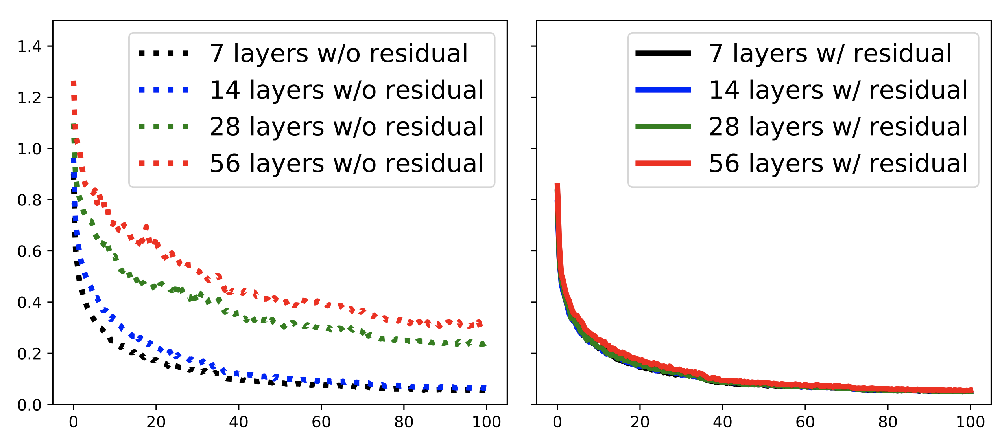
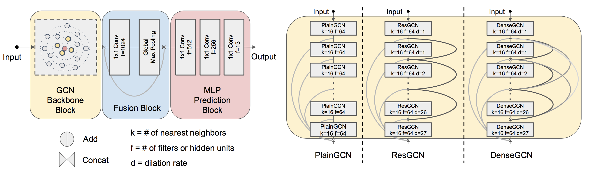

# DeepGCNs: Can GCNs Go as Deep as CNNs?
In this work, we present new ways to successfully train very deep GCNs. We borrow concepts from CNNs, mainly residual/dense connections and dilated convolutions, and adapt them to GCN architectures. Through extensive experiments, we show the positive effect of these deep GCN frameworks.

[[Project]](https://www.deepgcns.org/) [[Paper]](https://arxiv.org/abs/1904.03751) [[Slides]](https://docs.google.com/presentation/d/1L82wWymMnHyYJk3xUKvteEWD5fX0jVRbCbI65Cxxku0/edit?usp=sharing) [[Tensorflow Code]](https://github.com/lightaime/deep_gcns) [[Pytorch Code]](https://github.com/lightaime/deep_gcns_torch)
    
<p align="center">
  
</p>

## Overview
We do extensive experiments to show how different components (#Layers, #Filters, #Nearest Neighbors, Dilation, etc.) effect `DeepGCNs`. We also provide ablation studies on different type of Deep GCNs (MRGCN, EdgeConv, GraphSage and GIN).

<p align="center">
  
</p>


## How to train, test and evaluate our models
Please look the details in `Readme.md` of each task inside `examples` folder.
All the information of code, data, and pretrained models can be found there.
* DeepGCNs ([ICCV'2019](https://arxiv.org/abs/1904.03751), [TPAMI'2021](https://arxiv.org/abs/1910.06849)): [S3DIS](examples/sem_seg_dense), [PartNet](examples/part_sem_seg), [ModelNet40](examples/modelnet_cls), [PPI](/examples/ppi)
* DeeperGCN ([Arxiv'2020](https://arxiv.org/abs/2006.07739)): [OGB](examples/ogb)
* GNN'1000 ([ICML'2021](https://arxiv.org/abs/2106.07476)): [OGB](examples/ogb_eff)

## Recommended Requirements
* [Python>=3.7](https://www.python.org/)
* [Pytorch>=1.9.0](https://pytorch.org)
* [pytorch_geometric>=1.6.0](https://pytorch-geometric.readthedocs.io/en/latest/)
* [ogb>=1.3.1](https://github.com/snap-stanford/ogb) only used for experiments on OGB datasets
* [dgl>=0.5.3](https://github.com/dmlc/dgl) only used for the experiment `examples/ogb_eff/ogbn_arxiv_dgl`

Install enviroment by runing:
```
source deepgcn_env_install.sh
```

## Code Architecture
    .
    ├── misc                    # Misc images
    ├── utils                   # Common useful modules
    ├── gcn_lib                 # gcn library
    │   ├── dense               # gcn library for dense data (B x C x N x 1)
    │   └── sparse              # gcn library for sparse data (N x C)
    ├── eff_gcn_modules         # modules for mem efficient gnns
    ├── examples 
    │   ├── modelnet_cls        # code for point clouds classification on ModelNet40
    │   ├── sem_seg_dense       # code for point clouds semantic segmentation on S3DIS (data type: dense)
    │   ├── sem_seg_sparse      # code for point clouds semantic segmentation on S3DIS (data type: sparse)
    │   ├── part_sem_seg        # code for part segmentation on PartNet
    │   ├── ppi                 # code for node classification on PPI dataset
    │   └── ogb                 # code for node/graph property prediction on OGB datasets
    │   └── ogb_eff             # code for node/graph property prediction on OGB datasets with memory efficient GNNs
    └── ...

## Citation
Please cite our paper if you find anything helpful,

```
@InProceedings{li2019deepgcns,
    title={DeepGCNs: Can GCNs Go as Deep as CNNs?},
    author={Guohao Li and Matthias Müller and Ali Thabet and Bernard Ghanem},
    booktitle={The IEEE International Conference on Computer Vision (ICCV)},
    year={2019}
}
```

```
@article{li2021deepgcns_pami,
  title={Deepgcns: Making gcns go as deep as cnns},
  author={Li, Guohao and M{\"u}ller, Matthias and Qian, Guocheng and Perez, Itzel Carolina Delgadillo and Abualshour, Abdulellah and Thabet, Ali Kassem and Ghanem, Bernard},
  journal={IEEE Transactions on Pattern Analysis and Machine Intelligence},
  year={2021},
  publisher={IEEE}
}
```

```
@misc{li2020deepergcn,
    title={DeeperGCN: All You Need to Train Deeper GCNs},
    author={Guohao Li and Chenxin Xiong and Ali Thabet and Bernard Ghanem},
    year={2020},
    eprint={2006.07739},
    archivePrefix={arXiv},
    primaryClass={cs.LG}
}
```

```
@InProceedings{li2021gnn1000,
    title={Training Graph Neural Networks with 1000 layers},
    author={Guohao Li and Matthias Müller and Bernard Ghanem and Vladlen Koltun},
    booktitle={International Conference on Machine Learning (ICML)},
    year={2021}
}
```

## License
MIT License

## Contact
For more information please contact [Guohao Li](https://ghli.org), [Matthias Muller](https://matthias.pw/), [Guocheng Qian](https://www.gcqian.com/).
