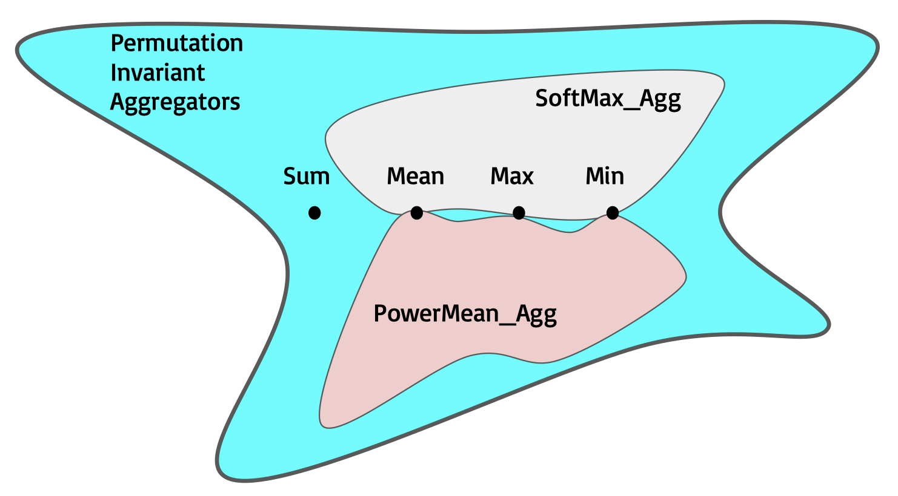
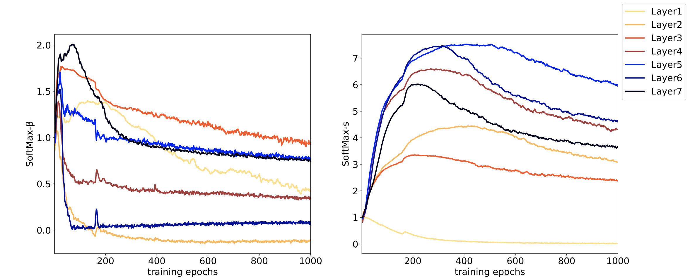
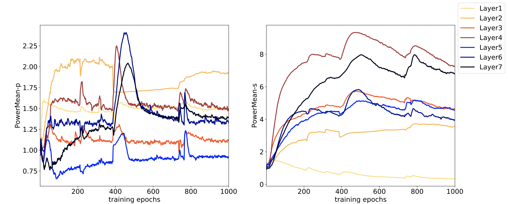

# DeeperGCN: All You Need to Train Deeper GCNs
In this work, we propose a novel Generalized Aggregation Function suited for graph convolutions. We show how our function covers all commonly used aggregations. Our generalized aggregation function is fully differentiable and can also be learned in an end-to-end fashion. We also show how by modifying current GCN skip connections and introducing a novel message normalization layer, we can enhance the performance in several benchmarks. Through combining our generalized aggregations, modified skip connections, and message normalization, we achieve state-of-the-art (SOTA) performance on four [Open Graph Benchmark](https://ogb.stanford.edu/) (OGB) datasets. 
[[paper](https://arxiv.org/pdf/2006.07739.pdf)]

## Overview
The definition of generalized message aggregation functions help us to find a family of differentiable permutation invariant aggregators. In order to cover the *Mean* and *Max* aggregations into the function space, we propose two variants of generalized mean-max aggregation functions, ***SoftMax_Aggβ(.)***
and ***PowerMean_Aggp(.)***. They can also be instantiated as a *Min* aggregator as β or p goes to −∞.

 

  

## DyResGEN

Learning curves of 7-layer DyResGEN with ***SoftMax_Aggβ(.)*** and MsgNorm.

  

Learning curves of 7-layer DyResGEN with ***PowerMean_Aggp(.)*** and MsgNorm.

 

## Results on OGB Datasets

|Dataset      |  Test     |  Rank@submission     |
|-------------|---------------|---------------|
|[ogbn-proteins](ogbn_proteins)|0.8580 ± 0.0017|1st|
|[ogbn-arxiv](ogbn_arxiv)   |0.7192 ± 0.0016|1st|
|[ogbg-ppa](ogbg_ppa )     |0.7712 ± 0.0071|1st|
|[ogbg-molhiv](ogbg_molhiv)  |0.7858 ± 0.0117|1st|

## Requirements

 - [PyTorch 1.5.0](https://pytorch.org/get-started/locally/) 
 - [torch-geometric 1.5.0](https://pytorch-geometric.readthedocs.io/en/latest/index.html)
 - [ogb >= 1.1.1](https://ogb.stanford.edu/docs/home/)

Install enviroment by runing:

    source deeper_gcn_env.sh
