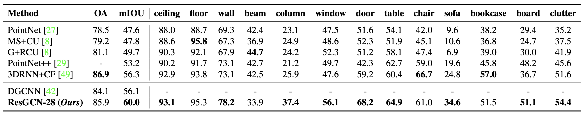

## [Semantic segmentation of indoor scenes](https://arxiv.org/pdf/1904.03751.pdf)

<p align="center">
    
</p>


Sem_seg_dense and sem_seg_sparse are both for the semantic segmentation task. 
The difference between them is that the data shape for the graph is different. 
As for sem_seg_sparse, data shape is N x C (N is number of nodes, C is feature_size) and there is a `batch` variable indicating the batch of each node. 
But for sem_seg_dense, data shape is B x C x N x 1 (B is batch size, N here means the number of nodes per graph).  
In gcn_lib, there are two folders: dense and sparse. They are used for different data shapes above.


### Train
We keep using 2 Tesla V100 GPUs for distributed training. 
``` 
cd examples/sem_seg/dense
```

Train ResGCN-28 (DeepGCN with 28 residually connected EdgeConv layers, dilated graph convolutions and batch normalization):
```
CUDA_VISIBLE_DEVICES=0,1 python train.py --multi_gpus --phase train --data_dir /data/deepgcn/S3DIS
```
Just need to set `--data_dir $yourpath/to/data`, dataset will be downloaded automatically. 

If you want to train model with other gcn layers (for example, mrgcn), run
```
python train.py --conv mr --multi_gpus --phase train --data_dir /data/deepgcn/S3DIS 
```
Other parameters for changing the architecture are:
```
--block         graph backbone block type {res, plain, dense}
--conv          graph conv layer {edge, mr}
--n_filters     number of channels of deep features, default is 64
--n_blocks      number of basic blocks, default is 28
```

A shallow version of DeepGCN (ResGCN-7) could be trained by the command below:
```
CUDA_VISIBLE_DEVICES=0 python train.py  --multi_gpus --phase train --data_dir /data/deepgcn/S3DIS --n_blocks 7
```


### Evaluation
Quick test on area 5, run:

```
python test.py --pretrained_model checkpoints/sem_seg_dense-res-edge-28-64-ckpt_best_model.pth  --batch_size 32  --data_dir /data/deepgcn/S3DIS 
```
 
#### Pretrained Models
Our pretrained model is available here [google driver](https://drive.google.com/open?id=1iAJbHqiNwc4nJlP67sp1xLkl5EtC4PU_).

Note: Please use our Tensorflow code if you want to reproduce the same result in the paper. 
The performance of pytorch code is slightly worse than tensorflow. mIOU is 52.11% on Area 5 compared to 52.49% in the tensorflow version.
```
python test.py --pretrained_model checkpoints/sem_seg_dense-res-edge-28-64-ckpt_best_model.pth  --batch_size 32  --data_dir /data/deepgcn/S3DIS
```
Lower the batch size if running out of memory. The batch size will not influence the test results.

